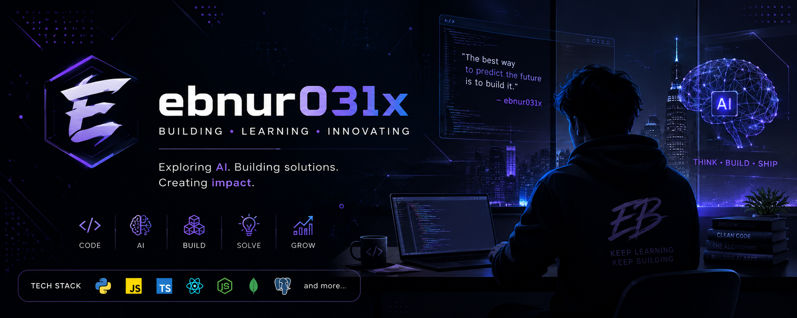

  

<h1 align="center">Hey, I'm Ebnur 👋</h1>

  <b>CS Student · AI Enthusiast · Builder</b>

  I like understanding how things work, building useful things, and learning by doing.

---

### 🧠 Currently learning

- Data Structures & Algorithms
- Machine Learning & Neural Networks
- AI Engineering
- Building real-world software

### 🔨 Projects

| Project | What I'm learning |
|---|---|
| 💸 [Spendly](https://github.com/ebnur031x/spendly) | Building a real application |
| 🧩 [CSE220 Data Structures](https://github.com/ebnur031x/cse220-data-structures) | Data structures in Java |
| ⚡ [CSE221 Algorithms](https://github.com/ebnur031x/cse221-algorithms) | Algorithms & problem solving |

### ⚙️ Tools I use

`Java` · `Python` · `Git` · `GitHub` · `VS Code` · `AI/LLMs`

### 🚀 Philosophy

> **Build. Learn. Ship.**

I don't want to just learn technology — I want to understand it deeply enough to build with it.

---

  Still learning. Still building. 🚀

