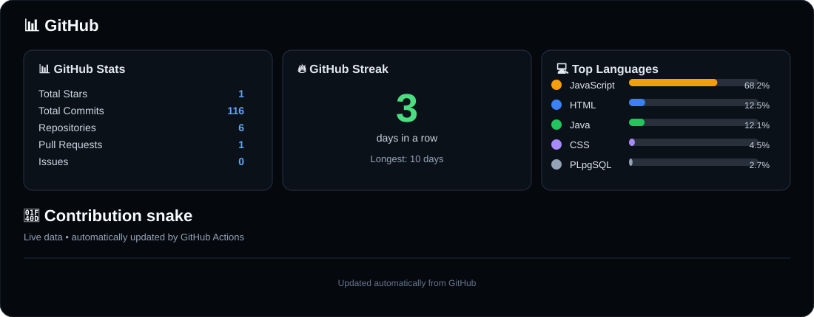

  

<h1 align="center">Hey, I'm Ebnur 👋</h1>

  <b>CS Student • AI • Software • Builder</b>

  I like understanding how things work, building useful software, and exploring AI.

---

### 🧠 Currently learning

- Data Structures & Algorithms
- Machine Learning & Neural Networks
- AI engineering and developer tools
- Building projects and shipping them

### 🛠️ Toolbox

  

### 📊 GitHub

  

### 🐍 Contribution snake

  <picture>
    <source media="(prefers-color-scheme: dark)" srcset="https://raw.githubusercontent.com/ebnur031x/ebnur031x/output/github-snake.svg?v=yellow2">
    <source media="(prefers-color-scheme: light)" srcset="https://raw.githubusercontent.com/ebnur031x/ebnur031x/output/github-snake-light.svg?v=yellow2">
    
  </picture>

---

  <i>Build. Learn. Ship.</i>

